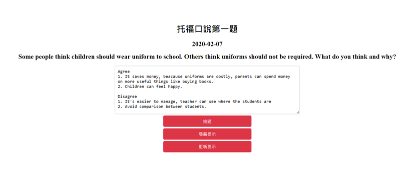
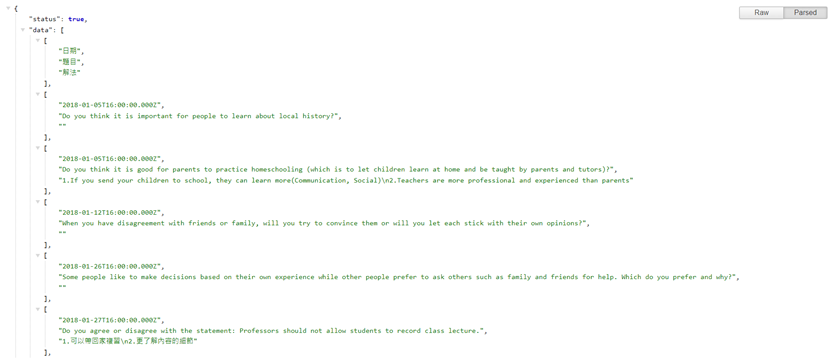
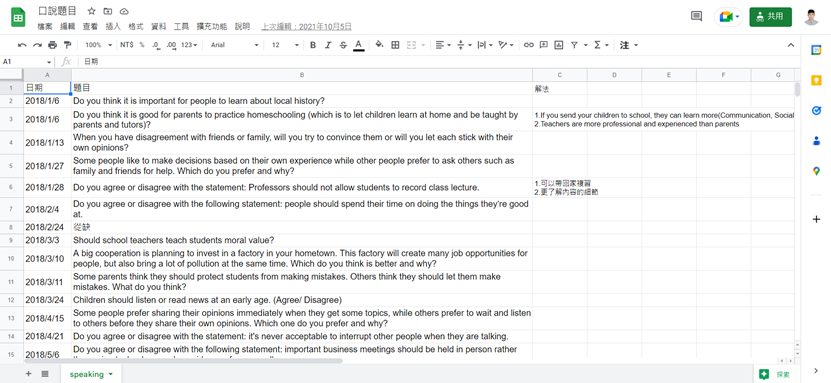

# toefl_practice_web
## About
- Created a web application for TOEFL Speaking practice.
- Developed a Google Sheet-based database API by Google Apps Script.
- Supported randomly picking questions and saved the note for specific questions.
- url: https://nyy28477590.github.io/toefl_practice_web/

## Web demo


## About Database API
- Implemented by Google Apps Script
Sample code
```
//Get all data from database
function doGet(e) {
  const id = SHEET_ID;
  const ss = SpreadsheetApp.openById(id);
  const sheet = ss.getSheetByName('speaking');
  const rows = sheet.getDataRange().getValues();

  const output = JSON.stringify({
    status : true,
    data : rows
  });

  return ContentService.createTextOutput(output).setMimeType(ContentService.MimeType.JSON);
}

//Write to database
function doPost(e) {
  const newVal = updateSheet(e.parameter);
  const output = {result:'success', data:e.parameter.data, val:newVal};
  return ContentService.createTextOutput(JSON.stringify(output)).setMimeType(ContentService.MimeType.JSON);
}

//Update Value to database
function updateSheet(data){
  //const data = {"row":3, "ans":3};
  //data = JSON.parse(data);
  const id = SHEET_ID;
  const sheet = SpreadsheetApp.openById(id).getSheetByName('speaking');
  const col = 3;
  const row = data.row;
  const range = sheet.getRange(row,col);
  const val = data.ans;
  range.setValue(val);
  return val;
  
  }
```

## API Demo: doPost()


## Database Demo

